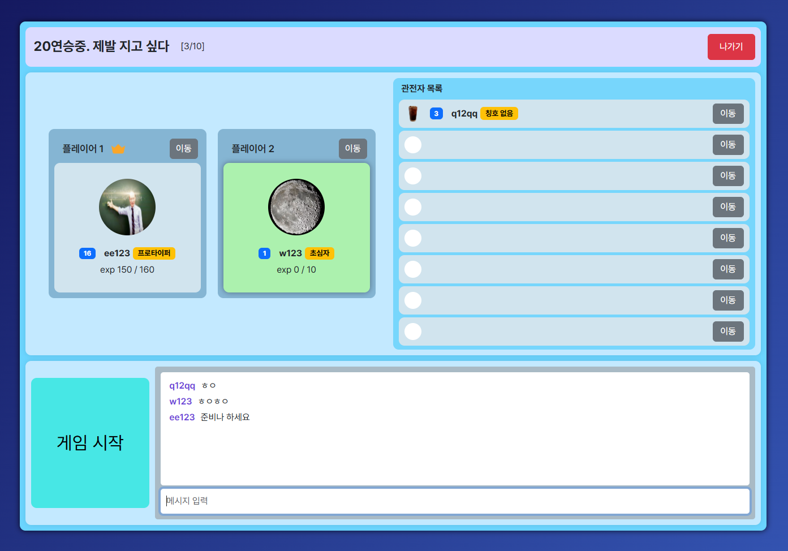

# 1인 프로젝트 - Keyboard Battle

## 📖 프로젝트 소개
> 실시간 채팅 및 타자 대결 게임 웹 프로젝트입니다.  
> 방 생성 및 검색 기능을 통해 자유롭게 방에 참여할 수 있으며, 방 비밀번호 설정이 가능합니다.  
> 타자 속도와 정확도를 따라 더 높은 점수를 기록할 수 있습니다.
- **프로젝트명**: Keyboard Battle
- **개발 기간**: 2025.02.06 ~ 2025.02.24
- **인원**: **1인 프로젝트 개발**

## 🖥️ 화면 구성
|미리보기|
|:---:|
||

|시작 화면|로그인|
|:---:|:---:|
|||

|회원가입|프로필|
|:---:|:---:|
|||

|자유 채널|방 생성 모달|
|:---:|:---:|
|||

|방 참가 모달|대기실|
|:---:|:---:|
|||

|게임 화면|게임 결과 화면|
|:---:|:---:|
|||

## ⚙ 기술 스택
### Development

### Database

## 📌 주요 기능
- 로그인/회원가입
- 세션기반으로 한 현재 접속자 관리
- 자유 채널에서 실시간 채팅 기능
- 방 생성 및 검색 기능, 방 비밀번호 설정
- 세션 검증으로 자유 채널 및 대기실 접근 제한
- 대기실 내에 준비하기 버튼을 통해 모든 유저가 준비 완료 시 게임 시작
- 게임 중 실시간 채팅 기능(플레이어, 관전자 모두 가능)
- 타자 현황 표시 및 타자 속도, 정확도 측정(상대방은 보이지 않음, 관전자는 모두 보임)
- **게임 중 명령어 입력 기능**
  - "/공격" : 상대방 화면에 블럭을 추가하여 공격
  - "/폭탄" : 화면 상에 블럭을 지움
- **게임 득점 시스템**
  - 오타없이(정확도 100%로) 문장을 완성할 경우, 콤보 += 1
  - 문장 완성 : (현재 타수 * 100) * ((한 문장 정확도) / 100)² * (0.2 * (콤보 + 1))
  - "/폭탄"(Bomb) 사용 시 문장 5개 없애기. 1개당 고정점수로 점수반영(1문장당 2000점). 폭탄은 콤보로 취급하지 않음.
  - 점수 보너스 : 현재 점수 + 도달 레벨 * (10000 * (정확도/100)²) + 최대콤보 * (10 * 평균타자속도) + 남은 폭탄 수 * 25000
- **게임 시스템(1문장 = 1블럭)**
  - 게임 시간 5분 동안 시간에 따라 1레벨부터 5레벨까지 레벨이 올라가며, 레벨 상승 시 문장 생성 속도 증가
  - 플레이어의 화면에는 최대 12블럭까지 쌓을 수 있으며, 12블럭 초과 시 해당 플레이어 게임 종료(남은 플레이어는 계속 진행)
  - 공격 게이지 : 매 문장(블럭) 완성 시, 평균 타자속도 * (콤보 + 1) * 0.005 만큼 증가
  - "/공격"명령어로 상대방에게 블럭 수를 추가시켜 공격할 수 있음(공격게이지 10당 1블럭, 최대 10블럭)
  - 게임 종료 시, 플레이어의 점수와 상대방의 점수 비교 후 승패 결정
  
## 프로젝트 설정 필요
> [!Note]
> 해당 프로젝트는 Dynamic Web Project로 실행(디버깅)을 위해 별도의 Tomcat 서버 설정이 필요합니다.  
> 배포 환경에 따른 MysqlConnection.java 파일의 DB 설정 경로을 변경해야 합니다.
